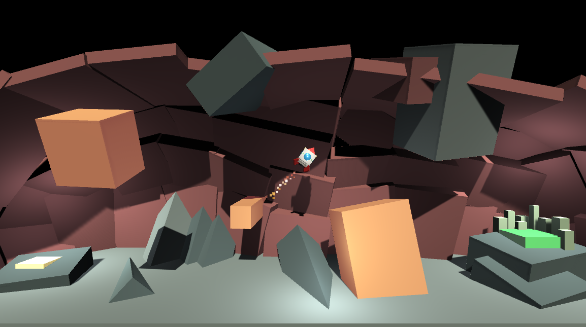

# Rescue Ship Icarus

You are the pilot of Rescue Ship Icarus and your job is to land safely at the base to load up fleeing citizens.

## About 

This project was a little flyer with gravity, player input, sfx, and moving obstacles. The thrust comes only from the bottom, so you need to rotate your ship and keep the nose up.

Time: about 8 hours

Course: [GameDev.tv Unity Game Developer 3D on Udemy](https://www.udemy.com/course/unitycourse2/)

## Learnings

- Focused a lot on tidy code
- Learned more about sine waves and radians and how to apply them for oscillation
- `Mathf.Approximately()` is neat and better for comparing floats to zero
- Level design (level "moments")

## Proud Of

I'm proud of the explosion details when the rocket crashes - in particular the flash of light.
